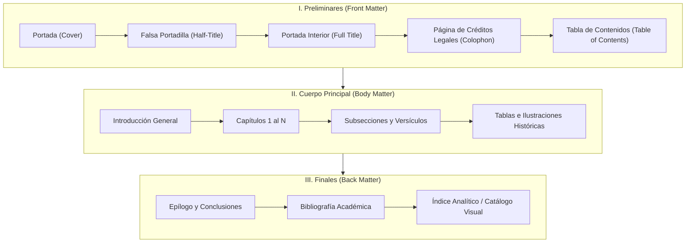

# Anatomía del Libro y Especificaciones CSS Paged Media

La maquetación formal de un libro requiere respetar la estructura tradicional de las partes del libro (*Book Anatomy*) y las reglas de medios paginados de W3C (*CSS Paged Media*).

---

## 1. Las Tres Grandes Divisiones de un Libro



### A. Preliminares (*Front Matter*)
* **Portada Principal:** Imagen a toda página o diseño gráfico editorial con título, subtítulo y autor.
* **Falsa Portadilla (*Half-Title*):** Página sobria que solo contiene el título del libro en versalitas centradas.
* **Portada Interior (*Full Title Page*):** Título completo, subtítulo, autor, compilador, filiación académica y año.
* **Página de Derechos / Créditos (*Colophon*):** Fecha de publicación, créditos de compilación, fuentes teológicas, licencias y mención del motor tipográfico.
* **Tabla de Contenidos (*TOC*):** Índice ordenado con enlaces directos a cada capítulo y subdivisión.

### B. Cuerpo Principal (*Body Matter*)
* Cada capítulo principal (`# CAPÍTULO ...`) se inicia obligatoriamente en una **página nueva** (`break-before: page;`).
* Los versículos o subdivisiones secundarias (`##`, `###`) fluyen naturalmente evitando saltos huérfanos (`break-after: avoid;`).
* **Figuras e Ilustraciones:** Centradas, con ancho controlado (`max-width: 90%; max-height: 480px;`), centradas con pie de figura explicativo, evitando quiebres dentro del bloque (`break-inside: avoid;`).
* **Tablas:** Diseñadas para impresión, con encabezados repetibles si abarcan varias páginas y anchos porcentuales.

### C. Finales (*Back Matter*)
* **Epílogo y Fuentes Consultadas.**
* **Bibliografía Académica:** Organizada por secciones jerárquicas con sangría francesa (*hanging indent*).

---

## 2. Reglas CSS Paged Media Fundamentales

### A. Definición de Página (`@page`)
```css
@page {
  size: A4 portrait; /* O '6in 9in', 'letter' */
  margin: 22mm 18mm 22mm 18mm;
}

@page :first {
  /* Suprimir márgenes o cabeceras en la portada */
  margin: 0;
}
```

### B. Saltos de Página y Control de Flujo
```css
/* Inicio de capítulo en página nueva */
h1, .chapter-break {
  page-break-before: always;
  break-before: page;
}

/* Evitar que un título quede al final de una página sin texto */
h1, h2, h3, h4 {
  page-break-after: avoid;
  break-after: avoid;
}

/* Evitar partir cajas de citas, tablas o figuras */
blockquote, figure, .editorial-table, .callout {
  page-break-inside: avoid;
  break-inside: avoid;
}

/* Control estricto de viudas y huérfanas */
p {
  orphans: 3;
  widows: 3;
}
```

### C. Sangría Francesa para Bibliografía
```css
.bibliography-list li, .bib-entry {
  padding-left: 2em;
  text-indent: -2em;
  margin-bottom: 0.6em;
}
```

### D. Cajas Destacadas (Callouts Especializados)
```css
.callout {
  margin: 1.2em 0;
  padding: 1em 1.2em;
  border-radius: 4px;
  break-inside: avoid;
}

.callout-scripture {
  background: var(--theme-card-bg);
  border-left: 4px solid var(--theme-secondary);
  font-style: italic;
}

.callout-factcheck {
  background: #F4F6F8;
  border-left: 4px solid var(--theme-primary);
  border: 1px solid var(--theme-border);
  border-left-width: 4px;
}
```
