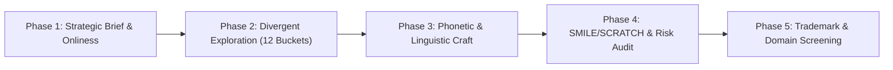

# Master Brand Naming & Verbal Identity

An elite brand naming framework combining world-class naming sprint methodologies from **Alexandra Watkins** (*Eat My Words* / *Hello, My Name Is Awesome*), **Marty Neumeier** (*The Brand Gap* / *Zag*), **Anthony Shore** (*Lexicon Branding* / *Operative Words*), and international trademark/linguistic clearance standards.

---

## When to Use This Skill

- Creating names for new companies, products, features, sub-brands, or open-source projects.
- Evaluating, vetting, or stress-testing candidate brand names.
- Brand repositioning, rebranding, or solving naming collisions and trademark conflicts.
- Establishing verbal identity systems, nomenclature architecture, and tagline matrices.
- Conducting sound symbolism (phonosemantic) and cross-linguistic phonetic audits.

Do not use for: Visual logo drawing (`logo-image-design`), full brand guideline image generation (`brandkit`), or formal legal trademark registration filings.

---

## Core Brand Naming Methodologies

### 1. Marty Neumeier's Positioning Foundation (The Onliness Statement)

Before generating names, establish the strategic anchor. A name cannot succeed if the brand's differentiation is ambiguous.

$$\text{Our brand is the } \mathbf{ONLY} \ [category] \ \text{that} \ [key\ differentiator] \ \text{for} \ [target\ audience] \ \text{in} \ [market/geography].$$

#### The 7 Naming Taxonomies

Every viable brand name falls into one of seven structural categories:

| Taxonomy | Description | Exemplars | Strengths & Trade-offs |
|---|---|---|---|
| **Descriptive / Functional** | Clearly states what the company or product does. | *General Motors*, *The Weather Channel*, *Whole Foods*, *PayPal* | **+** Immediate clarity, low marketing barrier. <br> **-** Harder to trademark, zero emotional poetry, can become restrictive. |
| **Evocative / Associative** | Uses metaphor, imagery, or cultural reference to suggest a feeling or philosophy. | *Virgin*, *Patagonia*, *Amazon*, *Nike*, *Slack*, *Monocle* | **+** Powerful emotional resonance, rich brand storytelling, high trademarkability. <br> **-** Requires educational marketing to establish context. |
| **Invented / Coined (Neologisms)** | Fabricated words engineered from phonemes or classical roots. | *Exxon*, *Kodak*, *Sony*, *Lexus*, *Acuity*, *Zillow* | **+** Clean trademark registration, pristine .com availability, empty vessel for meaning. <br> **-** Higher cost to educate consumers on pronunciation and meaning. |
| **Lexical / Wordplay / Compounds** | Compound words, clever spellings, portmanteaus, or rhymes. | *Netflix*, *FaceTime*, *YouTube*, *SoundCloud*, *Pinterest* | **+** Catchy, self-explaining, memorable. <br> **-** Risk of feeling trendy or dated if built on passing slang. |
| **Acronyms / Initialisms** | Abbreviations of descriptive names. | *IBM*, *BMW*, *SAP*, *IKEA*, *HSBC* | **+** Quick to say. <br> **-** Cold, difficult to remember, weak emotional resonance. (Default recommendation: avoid for new brands). |
| **Eponymous / Founder-led** | Named after founders, historical figures, or mythical icons. | *Tesla*, *Chanel*, *Ferrari*, *Hewlett-Packard*, *Hermès* | **+** Deep heritage and human connection. <br> **-** Tied to personal reputations; succession risk. |
| **Geographical / Origin** | Anchored to a city, region, or landscape. | *Cisco* (San Francisco), *Patagonia*, *Kona Brewing*, *Fiji Water* | **+** Inherent sense of terroir and authenticity. <br> **-** Can box the business in if expansion occurs beyond origin. |

---

### 2. Alexandra Watkins' SMILE & SCRATCH Evaluation Filter

Every candidate name is evaluated against a 12-point heuristic matrix: 5 green lights (SMILE) and 7 fatal dealbreakers (SCRATCH).

#### The SMILE Test (5 Winning Qualities)

1. **S — Suggestive:** Hints at a brand benefit, experience, or philosophy without being painfully literal (*e.g., Slack, Under Armour, Nest, Buffer*).
2. **M — Memorable:** Anchored in familiar cognitive hooks, rhythm, or unexpected contrast (*e.g., Apple, Drybar, Caterpillar*).
3. **I — Imagery:** Evokes a crisp mental visual in the listener's mind (*e.g., Timberland, Red Bull, Silk, LeapFrog*).
4. **L — Legs:** Enables a rich thematic ecosystem for copywriting, product tiers, and internal culture (*e.g., Ben & Jerry's pun universe, Wendy's "Frosty", Robinhood's Sherwood ecosystem*).
5. **E — Emotional:** Sparks warmth, curiosity, empowerment, or joy; connects with human feeling (*e.g., Innocent, Snuggle, TrueCar*).

#### The SCRATCH Test (7 Fatal Dealbreakers)

1. **S — Spelling-challenged:** Sounds like one thing, but spelled in an unintuitive way that forces spelling out over the phone (*e.g., Flickr, Speek, Qwik*).
2. **C — Copycat:** Mimics competitors or chases fleeting tech naming fads (*e.g., yet another "-ify", "-ly", or generic "CloudOps AI"*).
3. **R — Restrictive:** Boxes the company into a narrow product feature or geography that limits future pivots (*e.g., Boston Chicken had to rebrand to Boston Market*).
4. **A — Annoying:** Forced cute puns, arbitrary punctuation, or unnatural cringey wordplay.
5. **T — Tame:** Generic, forgettable corporate wallpaper (*e.g., Global Integrated Solutions, Synergy Systems*).
6. **C — Curse of Knowledge:** Internal jargon, technical acronyms, or esoteric trivia only the founders understand.
7. **H — Hard to pronounce:** Creates cognitive friction or hesitation when spoken aloud across diverse dialects.

---

### 3. Anthony Shore's Sound Symbolism & Phonosemantics

Words convey subconscious physical meaning through their acoustic frequencies and mouth mechanics.

#### Consonant Acoustics & Personality Mapping

```
                                    CONSONANT DYNAMICS
┌───────────────────────────────────────────────┬───────────────────────────────────────────────┐
│        PLOSIVES / STOPS (B, P, T, D, K, G)    │      FRICATIVES / SIBILANTS (F, V, S, Z, SH)  │
│  - Sudden release of air pressure             │  - Continuous, turbulent airflow              │
│  - Conveys: Speed, power, punch, durability   │  - Conveys: Smoothness, agility, flow, speed  │
│  - Examples: Kodak, GoPro, TikTok, BlackBerry │  - Examples: Visa, Figma, Sony, Swift, Zip    │
├───────────────────────────────────────────────┼───────────────────────────────────────────────┤
│          NASALS & LIQUIDS (M, N, L, R)        │            AFFRICATES (CH, J)                 │
│  - Resonant, continuous vocal tone            │  - Stop followed immediately by friction      │
│  - Conveys: Warmth, comfort, trust, humanity  │  - Conveys: Energy, sharpness, punchiness     │
│  - Examples: Lumen, Nest, Marvel, Airbnb      │  - Examples: Cheerios, JetBlue, Jiffy         │
└───────────────────────────────────────────────┴───────────────────────────────────────────────┘
```

#### Vowel Acoustic Frequency Matrix

- **Front Vowels ($i$, $e$ — *mini*, *swift*, *zip*, *ping*):** High-frequency acoustics. Subconsciously communicate: **compactness, high speed, agility, modern precision, lightness**.
- **Back Vowels ($a$, $o$, $u$ — *magna*, *sonos*, *sumo*, *ultra*):** Low-frequency acoustics. Subconsciously communicate: **mass, scale, strength, heritage, stability, luxury, authority**.

#### Metric Rhythm: Trochaic Dominance

Top global brands predominantly follow **trochaic meter** (STRESS-unstress, $\mathbf{/}\ \mathbf{x}$):
$$\text{AP-ple}, \quad \text{GOO-gle}, \quad \text{U-ber}, \quad \text{NI-ke}, \quad \text{SON-y}, \quad \text{FIG-ma}, \quad \text{RED-bull}$$
Trochees minimize cognitive load in English and romance languages, rolling off the tongue and cementing instant recall.

---

## The 5-Phase Brand Naming Sprint



### Phase 1: Strategic Positioning & Naming Brief
1. Define the **Onliness Statement**.
2. Identify brand archetype and personality sliders:
   - *Serious $\leftrightarrow$ Playful*
   - *Technical $\leftrightarrow$ Human*
   - *Classic $\leftrightarrow$ Avant-Garde*
   - *Disruptive $\leftrightarrow$ Institutional*
3. Set hard criteria: Target length (syllables/characters), desired taxonomies, geographic scope.

### Phase 2: Divergent Exploration (12 Creative Buckets)
Generate a broad candidate pool ($100+$ candidates) across 12 creative exploration vectors:
1. **Core Benefit / Superpower** (*e.g., Speed, Accuracy, Security*)
2. **Metaphor & Analogy** (*e.g., Flora/Fauna, Tools, Natural forces*)
3. **Action & Motion Verbs** (*e.g., Leap, Shift, Craft, Forge*)
4. **Historical & Mythological Figures** (*e.g., Janus, Hermes, Ada*)
5. **Invented Roots & Latin/Greek Affixes** (*e.g., -ex, -io, -ver, -os*)
6. **Compounds & Portmanteaus** (*e.g., Two strong mono-syllables fused*)
7. **Unexpected Contrasts / Oxymorons** (*e.g., SweetGreen, Urban Outfitters*)
8. **Everyday Objects Re-contextualized** (*e.g., Square, Notion, Capsule*)
9. **Geographic & Architectural Tropes** (*e.g., Atlas, Pillar, Arch*)
10. **Phonaesthetic Sounds** (*e.g., Pure plosives or fricatives*)
11. **Cultural Lore & Literature** (*e.g., Starbucks, Fahrenheit*)
12. **Playful Colloquialisms & Idioms** (*e.g., Headspace, Slack*)

### Phase 3: Phonetic & Linguistic Crafting
- Apply sound symbolism rules (plosives for punch, fricatives for speed, front/back vowels for weight).
- Optimize for trochaic rhythm.
- Test speakability with the **"Coffee Shop Test"**: Can you tell a barista your brand name in a noisy room and have them write it correctly on the cup?

### Phase 4: SMILE & SCRATCH Scoring
Score top 10 finalists on the 12-point criteria:

| Candidate | Suggestive | Memorable | Imagery | Legs | Emotional | Spelling Fail | Copycat | Restrictive | Annoying | Tame | Curse of Knowledge | Hard Pronounce | Verdict |
|---|:---:|:---:|:---:|:---:|:---:|:---:|:---:|:---:|:---:|:---:|:---:|:---:|:---:|
| **Name A** | 🟢 | 🟢 | 🟢 | 🟢 | 🟢 | ⚪ | ⚪ | ⚪ | ⚪ | ⚪ | ⚪ | ⚪ | **PASS (Strong)** |
| **Name B** | 🟢 | ⚪ | ⚪ | ⚪ | 🟢 | 🔴 | ⚪ | ⚪ | ⚪ | ⚪ | 🔴 | 🔴 | **FAIL (Scratch)** |

### Phase 5: Legal & Domain Preliminary Clearance
1. **Preliminary Trademark Check:**
   - US: USPTO TESS (Trademark Electronic Search System).
   - EU: EUIPO TMview / eSearch plus.
   - Global: WIPO Global Brand Database.
   - Search Nice Classification classes (e.g., Class 9 for software/SaaS, Class 42 for technology services, Class 35 for retail/business).
2. **Domain & Handle Strategy:**
   - Exact `.com` is gold, but not a blocker.
   - Modern TLDs (`.ai`, `.io`, `.co`, `.app`, `.dev`, `.design`).
   - Action verbs prefixes (`get[name].com`, `try[name].com`, `use[name].com`, `with[name].com`).
3. **Cross-Linguistic Audit:**
   - Screen candidate names across major world languages (Spanish, French, German, Mandarin, Japanese, Hindi, Arabic) for slang, profanity, or negative cultural connotations.

---

## Reusable Deliverable Templates

### Master Brand Naming Scorecard Template

```markdown
# Brand Naming Scorecard: [Project Name]

## 1. Positioning Anchor
- **Onliness Statement:** Our brand is the ONLY [category] that [differentiator] for [audience].
- **Core Archetype:** [e.g., The Creator / The Ruler / The Outlaw / The Sage]
- **Target Syllables:** [1-3 syllables]

## 2. Finalist Candidates & Evaluation

### Candidate 1: [NAME]
- **Taxonomy:** [Evocative / Invented / Compound / Descriptive]
- **Phonosemantic Breakdown:**
  - Consonants: [e.g., Plosive 'K' + Sibilant 'S' -> High energy with smooth flow]
  - Vowels: [e.g., Front vowel 'i' -> Nimble, precision]
  - Meter: [e.g., Trochaic (STRESS-unstress)]
- **SMILE Evaluation (Green Lights):**
  - Suggestive: [Score 1-5 + Notes]
  - Memorable: [Score 1-5 + Notes]
  - Imagery: [Visual evoked]
  - Legs: [Copywriting ecosystem possibilities]
  - Emotional: [Feeling sparked]
- **SCRATCH Risk Audit (Dealbreakers):**
  - Spelling / Pronunciation: [Clean / Ambiguous]
  - Category Copycat Risk: [Low / Moderate / High]
  - Restriction: [Can it support product line expansion?]
- **Preliminary Clearance:**
  - Nice Classes: [e.g., Class 9, 42]
  - Domain Availability: [[name].com, [name].ai, get[name].com]
  - Social Handles: [@name, @nameHQ, @use_name]
  - Global Linguistic Screening: [Clean in ES, FR, DE, ZH, JA, HI, AR]
```

---

## Best Practices & Golden Rules

- **Never name by consensus committee:** Committees gravitate toward tame, forgettable, inoffensive names that everyone tolerates but nobody loves. Decide using objective strategic criteria.
- **Fall in love with the positioning first, the name second:** Great brands infuse meaning into names over time; no name carries 100% of the brand story on day one.
- **Separate ideation from critique:** During divergent generation, generate 100+ ideas without judgment. Apply SMILE/SCRATCH strictly during the convergence phase.
- **The "Radio Test":** If spoken once on a podcast or radio show, does the listener know how to find it without spelling instructions?
- **Avoid trademark collisions early:** Searching trademark databases before falling in love with a name saves months of legal grief.

---

## Related Skills

- `@logo-image-design` — The visual mark, geometric construction, clear space, and asset register.
- `@brandkit` — Multi-panel visual brand identity decks, color palettes, and typographic systems.
- `@brand-growth-system-builder` — Strategic routing across 13 core brand and growth modules.
- `@brand-guidelines` — Tone of voice, verbal guidelines, and brand copy rules.

## Limitations
- Use this skill only when the task clearly matches the scope described above.
- Do not treat the output as a substitute for environment-specific validation, testing, or expert review.
- Stop and ask for clarification if required inputs, permissions, safety boundaries, or success criteria are missing.
