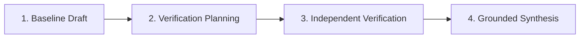

# Chain-of-Verification (CoVe) Reasoning

## Overview

**Chain-of-Verification (CoVe)** is an academic reasoning methodology developed by Meta AI & FAIR (Dhuliawala et al., 2023) designed specifically to eliminate hallucinations and confirm factual fidelity.

Standard language models suffer from hallucinations because autoregressive token generation compounds early errors. CoVe breaks generation into four orthogonal phases, isolating verification checks from generation bias.



## The 4-Stage CoVe Protocol

### 1. Baseline Drafting (System 1 Fast Generation)
Generate an initial, unconstrained response to the user's prompt without premature overthinking.

### 2. Verification Planning (Decomposition)
Decompose the baseline draft into atomic factual claims:
- **Temporal anchors:** Dates, version releases, chronological sequences.
- **Quantitative metrics:** Percentages, benchmarks, memory complexity numbers.
- **Attribution & origin:** Authors, algorithms, libraries, protocol specifications.
- Formulate orthogonal, isolated questions for each claim.

### 3. Independent Verification Execution (Context Isolation)
Execute verification checks **without** conditioning on the original baseline output:
- Query deterministic environment data, ground-truth docs, or run CLI inspection.
- Mark each claim as `VERIFIED`, `CONTRADICTED`, or `INCONCLUSIVE`.

### 4. Final Synthesis & Correction (System 2 Grounding)
Synthesize the verified evidence into a final response:
- Automatically excise or correct contradicted claims.
- Cite verifiable facts with 100% grounding.

---

## Programmatic CLI Usage

The repository provides a built-in deterministic CoVe engine:

```bash
# Run self-contained demonstration
npm run reason:cove -- --demo

# Run CoVe on arbitrary prompts
python3 tools/scripts/cove_engine.py \
  --prompt "What is the memory complexity of KV cache in Transformers?" \
  --baseline "KV cache stores key/value tensors taking O(N) memory per layer."
```

## When to Use
- **Fact-intensive synthesis:** When compiling reports, biographical data, or technical timelines.
- **Code & API verification:** When making assertions about function signatures, library availability, or SDK versions.
- **Auditing complex claims:** Whenever an assertion could potentially be contaminated by training bias or hallucination.

## Verification Checklist

- [ ] Has every factual claim been decomposed into a distinct query?
- [ ] Were verification questions executed independently from baseline bias?
- [ ] Were all contradicted or ungrounded assertions removed?
- [ ] Does the final synthesized output pass `npm run reason:cove`?

## Limitations

- CoVe adds computational overhead proportional to the number of verification questions.
- Independent verification requires reliable ground-truth tools or deterministic context.
- For non-factual or purely creative tasks (e.g. poetry, fictional writing), CoVe is not recommended.

## References

See [`references/cove_paper_summary.md`](references/cove_paper_summary.md) for full academic details, ablation studies, and mathematical proofs.
