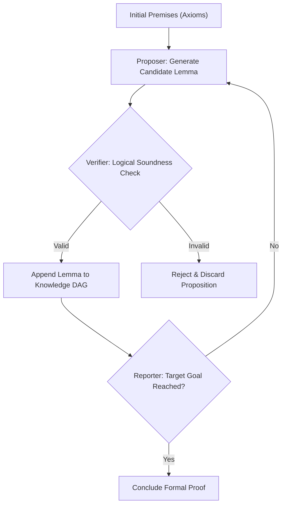

# Cumulative Reasoning (CR)

## Overview

**Cumulative Reasoning (CR)** is an academic reasoning methodology developed by researchers from Tsinghua University, Harvard University, and ByteDance Research (Zhang et al., 2023).

Standard Chain-of-Thought approaches suffer from **cascading error failure**: if step 2 makes a slight miscalculation, all subsequent 20 steps are ruined. Cumulative Reasoning solves this by decomposing derivation into an explicit **Directed Acyclic Graph (DAG) of atomic verified lemmas**.



## The Three-Role Architecture

### 1. The Proposer
Examines current verified premises and proposes a single new candidate lemma or intermediate proposition that logically follows.

### 2. The Verifier
Inspects the candidate lemma in isolation:
- Verifies all claimed prerequisite parents exist in the truth set.
- Checks mathematical or logical consistency.
- Rejects any proposition containing contradiction or unsupported speculation.

### 3. The Reporter
Scans the accumulated knowledge graph to determine if the desired goal, invariant, or conclusion has been formally derived.

---

## Programmatic CLI Usage

The repository provides a built-in deterministic Cumulative Reasoning engine:

```bash
# Run self-contained demonstration
npm run reason:cumulative -- --demo

# Deduce theorem from initial conditions
python3 tools/scripts/cumulative_reasoning.py \
  --problem "Verify consensus finality" \
  --target "Zero state forks occur under Byzantine threshold" \
  --premises "Quorum is 2f + 1" "Network latency <= Delta"
```

## When to Use Cumulative Reasoning

- **Invariant validation:** Verifying distributed state machine transitions and lock safety.
- **Formal specification checks:** Proving contract correctness before code changes.
- **Complex mathematical and algorithmic deductions.**

## Limitations

- Requires distinct, well-defined axioms or initial premises.
- Slower than one-shot generation for trivial everyday queries.

## References

See [`references/cumulative_reasoning_theory.md`](references/cumulative_reasoning_theory.md) for full mathematical formulation, graph properties, and benchmark validation.
