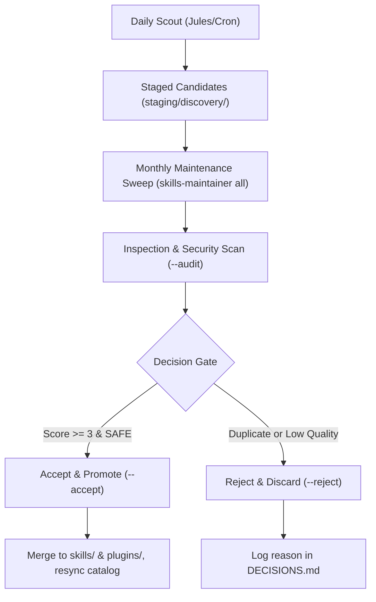

# Daily Discovery Scout & Monthly Triage Reference

This reference details the autonomous GitHub discovery search algorithms, risk thresholds, candidate staging schemas, and monthly decision gates for Google Jules and `skills-maintainer`.

---

## 1. Search Query Architecture

The Discovery Scout queries GitHub Search API across targeted topic facets and filenames:

| Target Category | Query Facet | Search String |
| :--- | :--- | :--- |
| **Agent Skills** | Topic Filters | `topic:agent-skills`, `topic:claude-skills`, `topic:agentic-skills`, `topic:antigravity-skills` |
| **Agent Skills** | Name & Spec | `"SKILL.md" in:path`, `agent skill in:name,description` |
| **MCP Servers** | Official Topics | `topic:mcp-server`, `topic:modelcontextprotocol`, `topic:mcp` |
| **MCP Servers** | Namespace & Pkg | `mcp-server in:name`, `"@modelcontextprotocol" in:description` |

---

## 2. Risk Rating & Quality Scoring Matrix

Each discovered repository is evaluated against a 5-point quality scale and four-tier security risk classification:

### Quality Score Calculation (1 to 5)
- **Base Score:** 1 point
- **+1 point:** Valid OSI open-source license detected (`MIT`, `Apache-2.0`, `BSD-3-Clause`, etc.)
- **+1 point:** Structured `SKILL.md` present in repository
- **+1 point:** Community validation ($\ge 10$ GitHub stars)
- **+1 point:** Broad adoption ($\ge 50$ GitHub stars)
- **Penalties:** $-3$ points for `HIGH` risk, $-1$ point for `MEDIUM` risk

### Risk Classification
- `SAFE`: Zero suspicious patterns, standard read/execution permissions.
- `LOW`: References standard API keys or authentication headers without hardcoded secrets.
- `MEDIUM`: Requests elevated OS privileges (`sudo`, `chmod +s`, root execution).
- `HIGH` / `CRITICAL`: High-risk patterns detected (reverse shell signatures, untrusted network-to-shell piping, base64 execution sinks, AST token exfiltration).

---

## 3. Candidate Staging Schema

Discovered items are staged under `staging/discovery/YYYY-MM-DD/`:

```
staging/discovery/2026-10-05/
├── mcps/
│   └── inspector.json
└── skills/
    └── unity-agent-skills/
        └── SKILL.md
```

### Staged Skill Format (`SKILL.md`)
```yaml
---
name: unity-agent-skills
description: "Production-grade game development skills for Unity AI coding agents."
license: MIT
risk: safe
source: community
date_added: '2026-10-05'
allowed-tools:
  - Read
  - Grep
  - Bash
metadata:
  repository: "https://github.com/Logiiiii/unity-agent-skills"
  stars: 3
  score: 3/5
---
```

---

## 4. Monthly Maintenance Decision Protocol

During the monthly repository maintenance sweep on the 1st of each month (`skills-maintainer all`):



### Review CLI Commands
```bash
# Display consolidated monthly discovery dossier
skills-maintainer review-discovery --dossier

# Run security and malware scans on all staged candidates
skills-maintainer review-discovery --audit

# Promote specific skill into active catalog
skills-maintainer review-discovery --accept <skill-id>

# Bulk promote all verified safe candidates
skills-maintainer review-discovery --accept all-safe

# Reject candidate with logged rationale
skills-maintainer review-discovery --reject <id> --reason "Redundant with existing skill"
```
