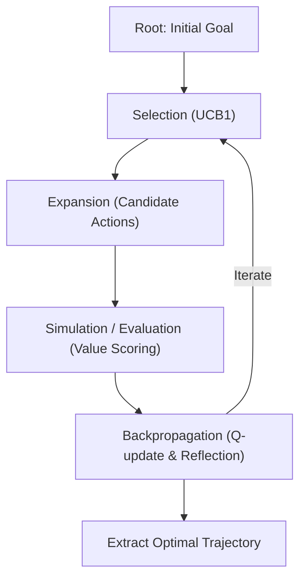

# Language Agent Tree Search (LATS)

## Overview

**Language Agent Tree Search (LATS)** is an advanced agent architecture developed by researchers at UIUC, MIT, and Princeton University (Zhou et al., 2023).

While standard linear ReAct or CoT loops get permanently stuck when encountering dead ends, LATS enables agents to perform **heuristic search over decision trajectories** using Monte Carlo Tree Search (MCTS).



## Core Algorithmic Mechanics

### 1. Selection with UCB1 (Upper Confidence Bound)
LATS balances exploitation of high-reward actions with exploration of unvisited trajectories:
$$\text{UCB1}(s, a) = Q(s, a) + c \cdot \sqrt{\frac{\ln N(s)}{1 + N(s, a)}}$$
Where $Q(s, a)$ is average historical reward, $N(s)$ is parent visits, and $c = \sqrt{2} \approx 1.414$.

### 2. Expansion
Samples $K$ diverse candidate sub-goals or actions at the current node state to explore multiple distinct avenues.

### 3. Simulation & Value Evaluation
Evaluates the candidate node using environmental signals (compiler output, test suite execution, or semantic value functions).

### 4. Backpropagation & Verbal Reflection
Propagates state values up to the root, incorporating verbal critiques into the node's state so future trajectories do not repeat identical mistakes.

---

## Programmatic CLI Usage

The repository provides a built-in deterministic LATS engine:

```bash
# Run self-contained demonstration
npm run reason:lats -- --demo

# Search optimal plan for complex goal
python3 tools/scripts/lats_engine.py \
  --goal "Architect high-throughput resilient distributed event pipeline" \
  --iterations 15 \
  --max-depth 4
```

## When to Use LATS

- **Multi-step refactoring:** When changing interfaces that affect dozens of dependent files.
- **Root-cause debugging:** When multiple hypotheses exist for a failing test suite.
- **Architectural trade-off analysis:** Exploring multiple system topology candidates before committing code.

## Limitations

- Higher token and computational budget than linear chain-of-thought.
- Tree depth should be capped (typically 3 to 6 steps) to prevent combinatorial explosion.

## References

See [`references/lats_architecture.md`](references/lats_architecture.md) for full algorithmic pseudo-code, mathematical bounds, and benchmark comparisons.
