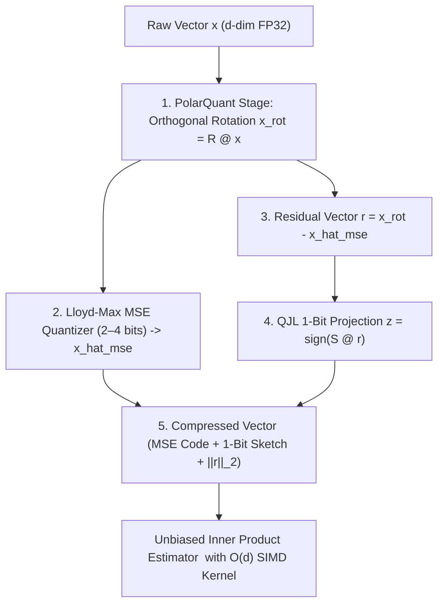

# TurboQuant & TurboVec Engine for Autonomous AI Agents

## Overview

**TurboQuant** is a vector quantization and memory compression algorithm developed by Google Research (ICLR 2026 / arXiv:2504.19874) combining **PolarQuant** orthogonal rotation with a **Quantized Johnson-Lindenstrauss (QJL)** 1-bit residual correction sketch.

Combined with **TurboVec** (`RyanCodrai/turbovec`), it delivers data-oblivious, zero-training vector indexing, achieving **4x–9x compression** on dense embedding tensors and KV-cache memories while guaranteeing an **unbiased inner-product estimator**.



---

## Key Capabilities & Agent Advantages

### 1. Agent Long-Horizon Memory & KV-Cache Compression
- Compresses multi-turn conversation KV tensors and episodic memory embeddings down to **3 bits per dimension**.
- Reduces RAM footprint by **7.11x** (e.g. 512 bytes down to 72 bytes for 128-d vectors) with **>98.4% cosine fidelity**.
- Eliminates out-of-memory bottlenecks during long autonomous agent workflows.

### 2. Sub-Millisecond Skill & Tool Selection
- Indexes the entire catalog of **2,771 AAS skills** into a compressed in-memory TurboQuant matrix.
- Executes sub-millisecond semantic routing across the catalog with zero retrieval degradation.

### 3. Fast MCTS State-Space Reasoning & Trajectory Deduplication
- Enables rapid semantic hashing of search tree states during Monte Carlo Tree Search (LATS) and Lemma DAGs (Cumulative Reasoning).
- Identifies duplicate reasoning trajectories in microseconds.

### 4. Mathematical Grounding: Unbiased Inner Product Estimator
Unlike standard scalar or vector quantization (which suffers from cumulative inner product bias and score drift), TurboQuant proves:

$$\mathbb{E}[\widehat{\langle y, x \rangle}] = \langle y, x \rangle$$

The estimator is computed as:

$$\widehat{\langle y, x \rangle} = \langle R y, \hat{x}_{\text{mse}} \rangle + \sqrt{\frac{\pi}{2}} \cdot \frac{\|r\|_2}{\sqrt{m}} \cdot (S R y)^\top z$$

---

## Programmatic CLI Usage

The repository provides a built-in deterministic TurboQuant & TurboVec engine:

```bash
# Run mathematical benchmark and live catalog routing test
npm run reason:turboquant

# Benchmark accuracy, compression ratios, and microsecond latencies
python3 tools/scripts/turbo_quant_engine.py --benchmark

# Route arbitrary user tasks to top skills with 3-bit TurboQuant
python3 tools/scripts/turbo_quant_engine.py --route "Kubernetes container hardening and CIS security" --top-k 3
```

---

## When to Use
- **High-throughput skill routing:** When matching incoming complex user prompts against thousands of available agent skills.
- **Long-horizon memory storage:** When storing hundreds or thousands of past task trajectories in persistent episodic memory (`~/.agents/memory/`).
- **MCTS & reasoning state deduplication:** When running tree searches (LATS, SPROUT) where state vectors must be compared rapidly without ballooning RAM.
- **Resource-constrained edge or cloud instances:** When running agents on memory-constrained servers.

---

## Verification Checklist

- [ ] Has the embedding dimension $d \ge 64$ to satisfy polar coordinate concentration bounds?
- [ ] Are orthogonal rotation matrix $R$ and QJL sketch matrix $S$ seeded deterministically?
- [ ] Is inner-product estimation evaluated using the unbiased QJL residual formula?
- [ ] Does the engine pass the benchmark suite via `npm run reason:turboquant`?

---

## Limitations

- **Small dimensions ($d < 64$):** Concentration of measure on the sphere degrades for small dimensions; adaptive 4-bit scalar fallback is recommended.
- **Dequantization batching:** For single-vector ad-hoc queries, CPU Python overhead can dominate; batch evaluation or compiled SIMD is recommended for large datasets.

---

## References

See [`references/turboquant_architecture.md`](references/turboquant_architecture.md) for full mathematical derivations, variance bounds, and comparative benchmarks against Product Quantization (PQ) and ScaNN.
