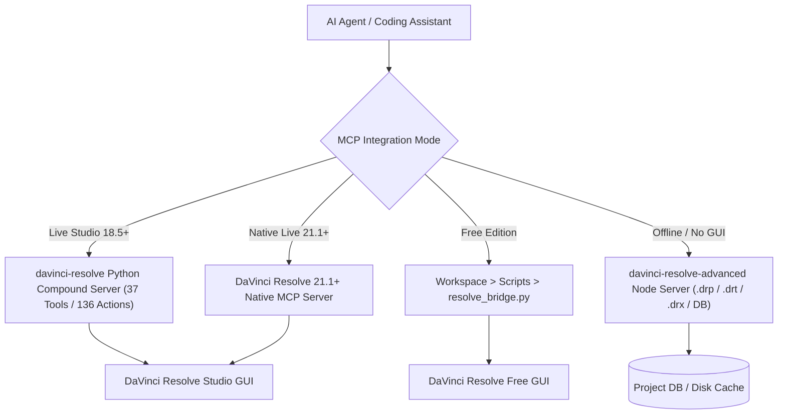

# DaVinci Resolve Master Automation & Editing Skill

Complete operational control of **Blackmagic DaVinci Resolve Studio & Free Editions** (versions 18.5 through 21.1+) via Model Context Protocol (MCP), Python Scripting API, In-App Bridge, and offline timeline/project authoring.

---

## 1. Architecture & Execution Modes



### Server Execution & Connection Modes

| Environment | Command / Setup | Connection Mode |
|---|---|---|
| **Python Compound Server** (Default) | `python /home/npirela/Proyectos/davinci-resolve-mcp/src/server.py` | Local stdio / Loopback |
| **Python Granular Server** (389 tools) | `python /home/npirela/Proyectos/davinci-resolve-mcp/src/server.py --full` | Local stdio |
| **Offline Advanced Server** (No Resolve open) | `bun /home/npirela/Proyectos/davinci-resolve-mcp/bin/davinci-resolve-advanced-mcp.mjs` | Local stdio |
| **Free Edition In-App Bridge** | Resolve UI: **Workspace ▸ Scripts ▸ resolve_bridge** | Loopback socket |
| **Local Web Control Panel** | `python -m src.control_panel --port 8766` | Web browser UI |

---

## 2. Core Compound Tools Landscape

### A. Project & Lifecycle Management
- `resolve_control`: Query version, active page, launch/quit Resolve, switch pages (`edit`, `color`, `fusion`, `fairlight`, `deliver`, `media`, `cut`).
- `project_manager`: Create, open, save, close, export, archive, restore, and delete projects.
- `project_settings`: Read and update timeline resolution, frame rate, color science (YRGB / ACES / RCM), conform settings.

### B. Media Pool & Ingest
- `media_pool`: Ingest media clips/sequences/folders, organize into bins, safe relink, manage proxy links, set clip marks.
- `media_storage`: Query mounted disks and system media volumes.
- `folder` / `media_pool_item`: Traverse bin hierarchies, query clip metadata, timecode, resolution, audio channels.

### C. Timeline & Precision Editing
- `timeline`: Create timelines, duplicate, get items by track, query playhead timecode, add/remove tracks, export XML/AAF/EDL.
- `timeline_item`: Set in/out points, perform ripple/roll trims, split clips, retime (optical flow/frame blend), transform (pan/zoom/tilt/rotation), crop, composite opacity/mode, audio volume/pan/sync offset.
- `timeline_frame`: **Vision Context** — capture the exact processed frame at playhead or timecode for visual inspection by multimodal LLM.
- `timeline_markers`: Add, modify, delete, and query frame markers with custom colors, notes, and duration.
- `timeline_ai`: Resolve 21+ AI features — Smart Reframe, Voice Isolation, Dialogue Leveler, Magic Mask, Scene Cut Detection.

### D. Color Grading & Looks
- `gallery` / `gallery_stills`: Grab and export gallery stills, preview grades with base64 images, apply still grades.
- `graph` / `timeline_item_color`: Node graph manipulation — add corrector nodes, serial/parallel/layer nodes, set CDL (Slope, Offset, Power, Saturation), apply 3D LUTs, query node states.
- `lut` / `dctl`: Discover, validate, apply, and manage 3D LUTs and custom DCTL transform shaders.

### E. Fusion VFX & Motion Graphics
- `fusion_comp`: Add, inspect, and modify Fusion compositions on timeline items.
- `fuse_plugin` / `script_plugin`: Load OpenFX and Fusion Fuse templates for generative animations, lower thirds, callouts.

### F. Fairlight Audio Engineering
- `timeline_item` (audio actions): Volume (-inf to +30dB), pan (-100 to +100), sync offset.
- Native Resolve 21.1 audio normalization: EBU R128 (-23 LUFS), ITU-R BS.1770 (-24 LUFS), YouTube (-14 LUFS), streaming target loudness.

### G. Render & Delivery
- `render`: Load render presets (YouTube, Vimeo, ProRes, H.264, H.265, IMF), add render jobs, monitor queue progress, trigger render execution.
- `render_presets`: Manage custom multi-format delivery presets and textless/stem configurations.

---

## 3. Mandatory Safety Laws & Production Gotchas

1. **Source Media Integrity (The Golden Rule):** Never modify, transcode, overwrite, or delete camera original files. All intermediate files, sidecars, and transcripts live under the project analysis root.
2. **Indexing Conventions:**
   - `item_index`: **0-based** (0 is the first clip on the track).
   - `track_index`: **1-based** (1 is Video 1 or Audio 1).
3. **Vision & WYSIWYG Evidence:**
   - Thumbnails (`GetCurrentClipThumbnailImage`) are per-clip static images and do NOT show Fusion comps or timecode-accurate frames.
   - For frame-accurate inspection, use `timeline_frame(action="capture", params={"timecode": "..."})` or `gallery_stills(action="grab_and_export")`.
4. **Non-Destructive Variant Timelines:**
   - When asked to tighten pauses or assemble rough cuts, **never mutate the user's primary timeline**.
   - Always duplicate the active timeline as a variant (e.g. `Timeline_Tightened_v1`) before executing edits.

---

## 4. Standard Operational Recipes

### Recipe 1: Session Initialization & State Discovery
```python
# 1. Connect & identify Resolve edition
resolve_control(action="get_version")

# 2. Get active project & timeline
project_manager(action="get_current_project")
timeline(action="get_current_timeline")
```

### Recipe 2: Tighten Long-Form Recording (Silence Removal)
1. Read-only audio scan of source audio to detect speech intervals and silences.
2. Duplicate timeline to `[Timeline Name] - Tightened v1`.
3. Perform cuts and ripple deletes on silence segments longer than threshold (e.g. >1.2s).
4. Report largest lifts and tightened timeline duration to user.

### Recipe 3: Look Matching & Color Grading
1. Open Color page: `resolve_control(action="open_page", params={"page": "color"})`.
2. Grab frame still: `gallery_stills(action="grab_and_export", params={"format": "jpg"})`.
3. Inspect visual via vision payload.
4. Apply CDL adjustments or 3D LUT to node graph: `graph(action="set_node_cdl", params={"node_index": 1, "slope": [1.05, 1.0, 0.98]})`.

---

## 5. Domain Skill Reference Map

- [resolve-session](file:///home/npirela/.agents/skills/resolve-session/SKILL.md): Start session, verify bridge/host state.
- [resolve-edit](file:///home/npirela/.agents/skills/resolve-edit/SKILL.md): Cuts, trims, retimes, speed ramps, and timeline assembly.
- [resolve-color](file:///home/npirela/.agents/skills/resolve-color/SKILL.md): Grade nodes, CDL, LUTs, and color science.
- [resolve-fusion](file:///home/npirela/.agents/skills/resolve-fusion/SKILL.md): VFX compositing, motion graphics, and DCTL.
- [resolve-audio](file:///home/npirela/.agents/skills/resolve-audio/SKILL.md): Fairlight audio, LUFS normalization, and voice isolation.
- [resolve-media-pool](file:///home/npirela/.agents/skills/resolve-media-pool/SKILL.md): Ingest, bins, relinking, and multicam.
- [resolve-delivery](file:///home/npirela/.agents/skills/resolve-delivery/SKILL.md): Render queues, export codecs, and QC.
- [resolve-conform](file:///home/npirela/.agents/skills/resolve-conform/SKILL.md): EDL/XML/AAF roundtrips and conform validation.
- [resolve-media-analysis](file:///home/npirela/.agents/skills/resolve-media-analysis/SKILL.md): Read-only FFprobe/FFmpeg/Whisper analysis.
- [resolve-rough-cut](file:///home/npirela/.agents/skills/resolve-rough-cut/SKILL.md): Rapid social / short-form assembly.
- [resolve-tighten-recording](file:///home/npirela/.agents/skills/resolve-tighten-recording/SKILL.md): Subtractive pause removal from takes.
