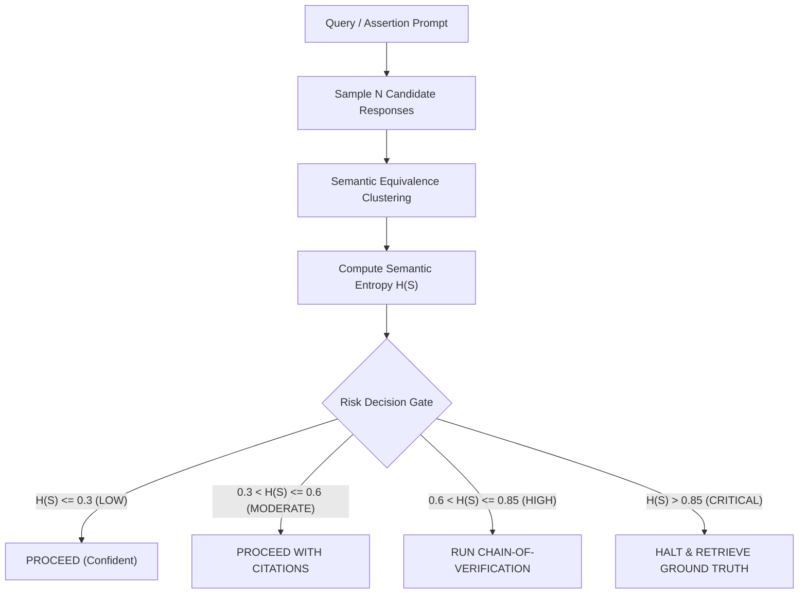

# Metacognitive Evaluator & Semantic Entropy

## Overview

The **Metacognitive Evaluator** is based on breakthrough academic research from the University of Oxford, Cambridge (Kuhn et al., Nature 2023), Google DeepMind (Kadavath et al., 2022), and UW/Meta (Asai et al., 2023 - Self-RAG).

Standard confidence scores (token log-probabilities) measure **lexical certainty** rather than **semantic truth**. A model can express identical wrong answers in 10 different wordings, fooling simple probability checks. **Semantic Entropy $H(S)$** clusters sampled outputs into meaning-invariant classes to calculate true semantic uncertainty.



## Mathematical Formulation

1. **Semantic Partitioning:** Group responses into discrete equivalence classes $\mathcal{C} = \{c_1, c_2, \dots, c_K\}$ where $r_i \sim r_j \iff r_i \equiv r_j$.
2. **Semantic Entropy:**
   $$H(S) = -\sum_{c \in \mathcal{C}} P(c) \log_2 P(c)$$
3. **Normalized Entropy:**
   $$\tilde{H}(S) = \frac{H(S)}{\log_2 |\text{Candidates}|}$$

---

## Programmatic CLI Usage

The repository provides a built-in deterministic Metacognitive Evaluator engine:

```bash
# Run self-contained demonstration
npm run reason:eval -- --demo

# Evaluate uncertainty over candidate completions
python3 tools/scripts/metacognitive_evaluator.py \
  --prompt "Who proved Fermat's Last Theorem?" \
  --candidates \
    "Andrew Wiles with Richard Taylor in 1994." \
    "Sir Andrew Wiles solved Fermat in 1994." \
    "Andrew Wiles proved the modularity theorem in 1995."
```

## When to Use

- **Security audits:** Before certifying that a vulnerability does not exist.
- **Architectural migrations:** When evaluating critical assumptions with zero room for hallucination.
- **Automated triage:** Determining whether an agent can answer autonomously or must fetch live context.

## Limitations

- Requires sampling multiple candidate generations (typically 3 to 10).
- Semantic equivalence clustering requires deterministic embeddings or token overlap matching.

## References

See [`references/semantic_entropy_formulation.md`](references/semantic_entropy_formulation.md) for full information-theoretic derivations, Nature paper insights, and calibration curves.
