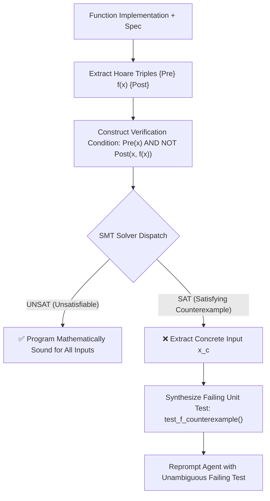

# Neuro-Symbolic Verifier & SMT Counterexample Engine

## Overview

**Neuro-Symbolic Verifier** combines the generative flexibility of Large Language Models with the mathematical soundness of formal SMT solvers (Z3, Dafny, Lean 4) based on 2025/2026 research (SOVER, Lean4Agent, Closed-Loop Dafny 2026).

While standard unit testing only tests sampled inputs, formal verification guarantees correctness across the entire mathematical input space. When a program violates its specification, the solver does not provide vague text explanations; it extracts a **concrete mathematical counterexample** ($x_c$), which is automatically synthesized into a deterministic regression test.



## Core Protocol

1. **Contract Extraction:** Annotate the code with pre-conditions (`require`), post-conditions (`ensure`), and loop invariants (`invariant`).
2. **Verification Condition Generation (VCG):** Translate program semantics into first-order logic formulas.
3. **Solver Query:**
   - If **UNSAT**: Output proof certificate; code is mathematically certified.
   - If **SAT**: Extract input vector $x_c$ where the post-condition is false.
4. **Automated Test Generation:** Instantly write `def test_counterexample(): assert f(x_c) == expected` so the developer or agent has an explicit, reproducible test case.

---

## Programmatic CLI Usage

```bash
# Run self-contained demonstration
npm run reason:neuro -- --demo

# Verify custom function contract
python3 tools/scripts/neuro_symbolic_verifier.py \
  --fn "safe_divide" \
  --pre "denominator != 0" \
  --post "result * denominator == numerator" \
  --json
```

## When to Use

- **Critical cryptographic & financial algorithms:** Zero tolerance for edge-case overflow or division errors.
- **Distributed state machines:** Verifying consensus invariant preservation.
- **Compiler & parser modifications:** Proving grammar and AST transformation equivalence.

## Verification Checklist

- [ ] Were explicit pre-conditions and post-conditions defined?
- [ ] In case of SAT counterexample, was a deterministic unit test generated?
- [ ] Does the final implementation pass the solver with UNSAT proof certificate?

## Limitations

- Nonlinear real arithmetic and complex pointer aliasing can be undecidable or timeout in general SMT solvers.
- Requires well-defined mathematical specifications.

## References

See [`references/neuro_symbolic_2026.md`](references/neuro_symbolic_2026.md) for full academic proofs, Hoare logic foundations, and benchmark comparisons.
