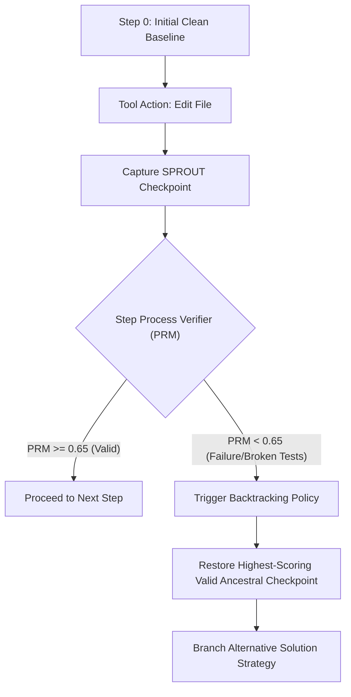

# SPROUT: Snapshot-Based Rollout & Verifier-Guided Backtracking

## Overview

**SPROUT (SnaPshot-based RollOUT)** is a 2025/2026 reinforcement learning and agent architecture designed specifically for long-horizon software engineering and complex reasoning tasks (OpenReview 2025; Rohatgi et al., 2025).

Traditional agents suffer from catastrophic error accumulation: when a bad edit or syntax bug is introduced at step 8 of a 15-step task, subsequent steps compound the failure into an unrecoverable state or enter infinite fix loops. SPROUT maintains lightweight filesystem and agent context snapshots at each tool call, executing **probabilistic backtracking** to the best verified checkpoint.



## Algorithmic Workflow

1. **Pre-Mutation Snapshot:** Prior to executing risky file writes or environment changes, store the current AST/diff and state vector.
2. **Step-Level Verification (PRM):** Execute unit tests, linters, or semantic assertions.
3. **Verifier-Guided Backtracking (VGB):** If validation fails, do not restart from scratch (wasting tokens) nor push forward with dirty state. Instantly revert to the last sound checkpoint.
4. **Alternative Rollout:** Re-plan from the sound state with the failure trace recorded as a negative constraint.

---

## Programmatic CLI Usage

```bash
# Run self-contained demonstration
npm run reason:sprout -- --demo

# Simulate SPROUT checkpointing on a task
python3 tools/scripts/sprout_engine.py --goal "Refactor authentication middleware" --json
```

## When to Use

- **Multi-file refactors:** When making structural changes where intermediate states might break builds.
- **Complex bug fixes:** When testing multiple competing hypotheses for root causes.
- **Agentic CI/CD autofixes:** When automated PR remediation must guarantee zero dirty side-effects.

## Verification Checklist

- [ ] Was a clean snapshot captured before file modifications?
- [ ] Did the step verifier score exceed the 0.65 PRM threshold?
- [ ] In case of test failure, was the state cleanly rolled back before re-attempting?

## Limitations

- Snapshot storage requires lightweight tracking (Git worktrees, AST diffs, or in-memory state).
- Backtracking budget must be bounded (default max 5 rollbacks) to prevent infinite search.

## References

See [`references/sprout_paper_summary.md`](references/sprout_paper_summary.md) for full academic details, benchmark comparisons on SWE-bench Pro, and mathematical formulation.
