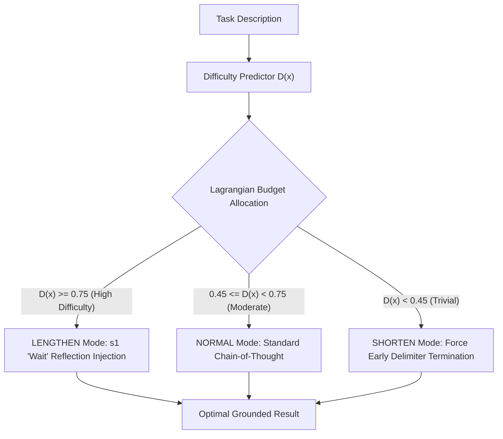

# Adaptive Test-Time Compute Allocation & Budget Forcing

## Overview

**Adaptive Test-Time Compute Allocation & Budget Forcing** is based on the 2025/2026 test-time scaling literature (Muennighoff et al., ACL 2025; Zhai et al., arXiv 2026; Manvi et al., ICLR 2026).

Uniform compute allocation wastes thousands of tokens on trivial questions while under-thinking on complex, high-consequence system refactors. This skill provides:
1. **Difficulty-Aware Budget Scaling:** Formulated as a constrained Lagrangian optimization problem to dynamically allocate thinking tokens $B(x)$.
2. **Budget Forcing (s1 Paradigm):**
   - **Lengthening:** Injects explicit *"Wait, let me double check..."* reflection tokens when confidence is ambiguous.
   - **Shortening:** Force-terminates thinking loop early when solutions converge, avoiding "overthinking" failure modes.



## Programmatic CLI Usage

```bash
# Run self-contained demonstration
npm run reason:budget -- --demo

# Calculate optimal compute budget for custom task
python3 tools/scripts/test_time_budgeting.py \
  --task "Design distributed lock with lease renewal and RAII memory safety in Rust" \
  --json
```

## When to Use

- **Inference Cost Optimization:** Capping token waste on simple queries while reserving budget for deep reasoning.
- **Complex Algorithmic & Security Tasks:** Forcing the agent to pause and double-check edge cases before executing irreversible actions.
- **Preventing Overthinking:** Halting speculative reasoning loops when standard solutions are verified.

## Verification Checklist

- [ ] Was the difficulty score calculated before initiating multi-turn search?
- [ ] Was budget forcing applied (lengthening for high-risk / shortening for simple)?
- [ ] Were overall token expenditures within the global budget cap?

## Limitations

- Requires estimating task hardness heuristics or model introspection signals.
- In extreme latency-critical streaming scenarios, budget lengthening adds multi-second generation delay.

## References

See [`references/test_time_scaling_2026.md`](references/test_time_scaling_2026.md) for full mathematical formulation, Lagrangian dual proofs, and benchmark results.
